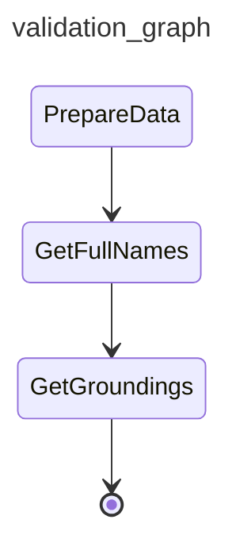

# CxG experiments 

We have two experiments related with CxG annotation:
- **Old one**: `cellsem_agent/graphs/cxg_annotate/cxg_annotate_graph.py` 
    This experiments uses a set of manually downloaded papers related with gut, retina etc.
- **New one**: `cellsem_agent/graphs/cxg_annotate/cxg_annotate_graph_v2.py` 
    This is the new experiment. An example input file is here: [cellsem_agent/graphs/cxg_annotate/resources/ac8619d0-4fff-4296-913a-819d1e361ba0_cxg_dataset_unique.tsv](cellsem_agent/graphs/cxg_annotate/resources/ac8619d0-4fff-4296-913a-819d1e361ba0_cxg_dataset_unique.tsv)

## New experiment workflow

`cxg_annotate_graph_v2.py` has a main function that runs the whole experiment graph. Experiment graph is as follows:



- **PrepareData**: Prepares the data for the experiment. It reads the input TSV file, converts into the desired format and stores them into `ctx.state` which is a shared state among the workflow tasks. This step also downloads the required publications.
- **GetFullNames**: Uses ChatGPT to get the full names of the cell types based on the publication full text.
- **GetGroundings**: Uses Annotator Agent (`cellsem_agent/agents/annotator/annotator_agent.py`) to get the ontology groundings for the cell types.

Script has a `main` function that runs the whole experiment graph. You can run the script directly.

An environment file is needed at the project root folder named `.env` with the following variables (`cellsem-agent/.env`):
```
OPENAI_API_KEY=
```

### Outputs:

Then the pipeline is run, two main outputs are generated:
- `cellsem_agent/graphs/cxg_annotate/resources/groundings.tsv`: The main annotation results. `grounding_cl_id` and `grounding_cl_label` are found by the agent, `cl_id` and `cl_label` are the truth values from the input file.
- `cellsem_agent/graphs/cxg_annotate/resources/cell_type_annotations_un_filtered.tsv`: A not important intermediate file that contains all the cell type annotations provided by the agent. Agent uses fullname and abbreviation to find the groundings. This file contains all the groundings found by the agent in case you want to optimize the prioritization logic. Currently Full name has the higher priority and it is returned as the first grounding to be used.

### Statistics:

A manuel step to calculate the metrics is needed after the experiment is run. Metrics script is here: `cellsem_agent/graphs/nlm_annotate/grounding_statistics.py`. Update script to point to the correct `groundings.tsv` file and run it.
This scripts prints something like this:

```
Truth table: TP=19, FP=13, FN=0, TN=0
Precision: 0.594
Recall: 1.000
F1 score: 0.745
```

### Running in test mode:

If you set `IS_TEST_MODE=True`, the experiment will run in test mode. In this mode, only a small subset of data (`TEST_ANNOTATIONS_COUNT=4`) is processed to allow for quick testing and debugging. This is useful for development and troubleshooting.

Set `IS_TEST_MODE=False`, to run the full experiment.

### Beware of caching:

The experiment uses caching to store intermediate results and avoid redundant computations and avoid expensive ChatGPT calls. If you make changes to the code or input data, you may need to clear the cache to ensure that the experiment runs with the latest information.

Here are the cache directories used in the experiment:
- `cellsem_agent/graphs/cxg_annotate/resources/publications`: Publications downloaded in the `PrepareData` step is stored here in format: `DOI_10_1038_s41586-018-0698-6.txt`
- `cellsem_agent/graphs/cxg_annotate/resources/expansions`: Caching of the `GetFullNames` step. Example cache file name: `DOI_10_1038_s41586-018-0698-6_batch_0.json`
- `cellsem_agent/graphs/cxg_annotate/resources/cache`: Caching of the `GetGroundings` step. Example cache file name: `groundings_batch_0.json`

Delete these folders as needed to clear the cache and run a fresh but $$$ experiment. The folders should be automatically created when script is run.